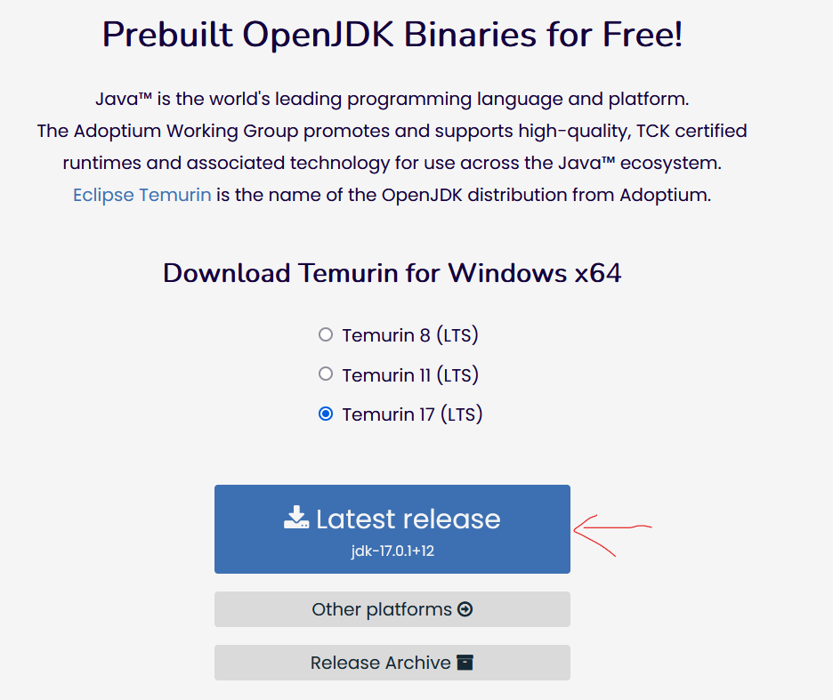
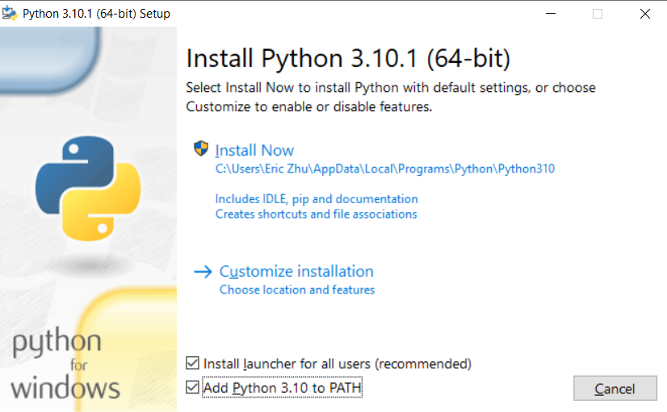
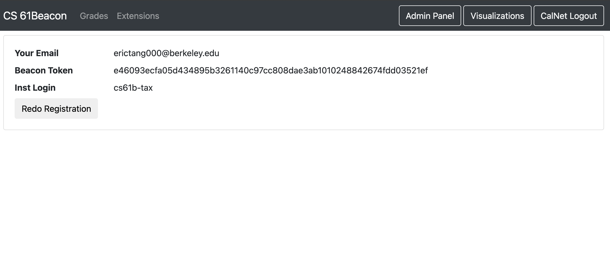

# Lab 1: Intro to Java & Git

**Due Date: Friday 1/28 11:59PM.**

**Note:** This lab is **mandatory** and **non-droppable** as set up is crucial for completing assignments in the class.

Welcome to Lab in CS61B! The goal for lab assignments is to teach you practical programming and software engineering skills. What you learn through labs should be able to help you in this class, future classes, and your future as a programmer. Today's lab mainly involves setting up your computer and some of the basic tools we are using for this class. It is a fairly long assignment, but learning these skills early on helps you better transition into CS61B. **Usually lab assignments will be due Friday the same week of release at 11:59PM, but this lab will be due next Friday 1/28 at 11:59PM PT.** With this extended deadline, please take do not rush through this lab as setting up your computer and learning these tools are fundamentals that we will quickly put to use. That said, do not wait to complete this lab assignment as the setup is necessary to complete other class assignments.

Future labs will allow for partners, but for this lab everyone needs to set up their computer so **make sure to complete the whole lab yourself**. This does not mean that you cannot discuss the lab with others, in fact we highly encourage you to do so. We have found that it works best to work with students with the same operating system in case you run into any OS specific problems.

# Table of Contents

- [A. Terminal Basics](#a-terminal-basics)
    - [Text Editor](#text-editor)
    - [Terminal Installation (Windows)](#terminal-installation-windows)
    - [Essential Terminal Commands](#essential-terminal-commands)
- [B. Instructional Account Setup](#b-instructional-account-setup)
    - [Obtaining an Instructional Account](#obtaining-an-instructional-account)
    - [Accessing Remotely](#accessing-remotely)
    - [Registering and Updating Password](#registering-and-updating-password)
    - [Setting Up Git Repo on Instructional Machines](#setting-up-git-repo-on-instructional-machines)
- [C. Personal Computer Setup](#c-personal-computer-setup)
    - [Windows Setup](#windows-setup)
    - [macOS Setup](#macos-setup)
    - [Unix / Linux Setup](#unix--linux-setup)
    - [Test Run](#test-run)
    - [Setting Up Git Repo on Local Computer](#setting-up-git-repo-on-local-computer)
- [D. Java Compilation & Development](#d-java-compilation-and-development)
    - [Java and Compilation](#java-and-compilation)
    - [Why Compilation?](#why-compilation)
    - [Compiling Java Programs](#compiling-java-programs)
    - [Running Java Programs](#running-java-programs)
- [E. Writing Java Programs](#e-writing-java-programs)
    - [Java is Object-Oriented](#java-is-object-oriented)
    - [Format of a Java Program](#format-of-a-java-program)
    - [Comments in Java](#format-of-comments-in-java)
- [F. Git and First Assignment](#f-using-git-and-first-assignment)
    - [Git Basics](#git-basics)
    - [CS61B Git Setup](#cs61b-git-setup)
    - [General Git Workflow: Receiving Assignments](#general-git-workflow-receving-assignments)
    - [Java Assignment: Leap Year](#java-assignment-leap-year)
    - [General Git Workflow: Saving Your Work](#general-git-workflow-saving-your-work)
    - [Testing Leap Year Locally](#testing-leap-year-locally)
    - [Testing Leap Year with Unit Tests](#testing-leap-year-with-unit-tests)
    - [General Git Workflow: Submitting](#general-git-workflow-submitting)
- [G. Submission and 61B Tools Setup](#g-submission-and-61b-tools-setup)
    - [Beacon Setup](#beacon-setup)
- [H. Common Errors Doc](#h-common-errors-doc)

# A. Terminal Basics

## Text Editor

*Note: If you already have a text editor you like from a previous class, feel free to skip this step. Word processors like Microsoft Word do not count.*

This [video walkthough](https://youtu.be/wVoMtE2Vb2A) goes over how to install and use text editor.

Throughout the semester you will find it helpful to have a text editor and one will be required to complete this lab. In a following lab we will be switching to using IntelliJ, a powerful IDE (Integrated Development Environment), to develop all of your Java code. Some popular text editor options are [Visual Studio Code](https://code.visualstudio.com/download), [Sublime Text](https://www.sublimetext.com/) and [Atom](https://atom.io/). You should be able to use the default installation recommendations, but if you run into problems do not hesitate to ask for help!

## Terminal Installation (Windows)

*Note: If you either do not have a Windows computer or do have a Windows computer but installed Git Bash in a previous class feel free to skip this step.*

In this class we will be using the terminal to run programs, tests, etc. All commands we will be supplying will be for a bash shell. Unfortunately the default Windows command prompt is not a bash shell, so we will need to install one. **Please install the [Git Bash terminal](https://git-scm.com/downloads)** by clicking the **"Download 2.34.1 for Windows"** button. You should be able to select the default configurations with the exception of the following option.

*Note: Generally , git will choose the right version for you to download. If you would like to check whether your operating system is 32 bit or 64 bit, please refer to [here](https://support.microsoft.com/en-us/windows/32-bit-and-64-bit-windows-frequently-asked-questions-c6ca9541-8dce-4d48-0415-94a3faa2e13d).*

You can choose the **default editor used by git** to be any of the options in the list if you have Visual Studio Code or Sublime Text or Atom installed. Students often find these easier to use than Nano or Vim (which can be a bit tricky to figure out if you have never used them).


After installing you should now have a Bash terminal on your computer. Whenever we refer to a terminal throughout the class you should use Git Bash instead of any other terminal on your Windows computer (e.g. do not use CMD or Powershell).

## Essential Terminal Commands

This [video walkthrough](https://youtu.be/0q-KghARJ0k) demos the essential terminal commands.

In CS 61B we will be using the terminal extensively, even more than you likely did in previous classes. Bash commands can be pretty powerful and will allow you to create folders or file, navigate through your file system, etc. To jump start your knowledge we have included a short guide of the most essential commands that you will be using in this class. Please carefully read this and try to familiarize yourself with the commands. We will help you as you get started, but by the end of the class we hope that you will have become a proficient user of the bash terminal.

- `cd`: change your working directory

    ```sh
    cd hw
    ```

    This command will change your current directory to `hw`.

- `pwd`: print working directory

    ```sh
    pwd
    ```

    This command will tell you the full path for the current directory you are in if you are not sure where you are.

- `.`: your current directory

    ```sh
    cd .
    ```

    This command will change your directory to the current directory (aka do nothing).

- `..`: one parent directory above your current directory

    ```sh
    cd ..
    ```

    This command will change your current directory to its parent. If you are in `/workspace/day1/`, the command will place you in `/workspace/`.

- `ls`: list files/folders in directory

    ```sh
    ls
    ```

    This command will list all the files and folders in your current directory.

    ```sh
    ls -a
    ```

    This command will list all the files and folders in your current directory, including hidden files.

    ```sh
    ls -l
    ```

    This command will list all the files and folders in your current directory with timestamps and file permissions. This can help you double-check if your file updated correctly or change the read-write- execute permissions for your files.

- `mkdir`: make a directory

    ```sh
    mkdir dirname
    ```

    This command will make a new directory within the current directory called `dirname`.

- `rm`: remove a file

    ```sh
    rm file1
    ```

    This command will remove `file1` from the current directory. It will not work if `file1` does not exist.

    ```sh
    rm -r dir1
    ```

    This command will remove the `dir1` directory recursively. In other words, it will delete all the files and directories in `dir1` in addition to `dir1` itself. Be careful with this command!

- `cp`: copy a file

    ```sh
    cp lab1/original lab2/duplicate
    ```

    This command will copy the `original` file in the `lab1` directory and create a `duplicate` copy in the `lab2` directory.

- `mv`: move or rename a file

    ```sh
    mv lab1/original lab2/original
    ```

    This command moves `original` from `lab1` to `lab2`. Unlike `cp`, `mv` does not leave `original` in the `lab1` directory.

    ```sh
    mv lab1/original lab1/newname
    ```

    This command does not move the file but rather renames it from `original` to `newname`.

There are some other useful tricks when navigating on command line:

- UNIX can complete file names and directory names for you with tab completion. When you have an incomplete name (for something that already exists), try pressing the `tab` key for autocomplete or a list of possible names.
- If you want to retype the same instruction used recently, press the `up` key on your keyboard until you see the correct instruction. This saves typing time if you are doing repetitive instructions (like running Java programs on command line while testing).

# B. Instructional Account Setup

This [video](https://youtu.be/M4ySSbRE3NI) demos how to set up your instructional account.

## Obtaining an Instructional Account

In this class you will be using EECS instructional accounts to manage and submit your work. First you must **request an account [here](https://inst.eecs.berkeley.edu/webacct)**. Select the "Login using your Berkeley CalNet ID" option, login, and then click the "Get a new account" button for CS61B. You should receive a login of the form `cs61b-***` and a password. We will show you how to change the password later, but for now hold onto the password. If you for whatever reason forget your password or otherwise need to reset it, you can do so from the same page.

## Accessing Remotely

You can use your `cs61b-***` login and password to sign into the lab computers directly when in lab. It is often convenient to do so from your personal computer, so you do not have to be physically present in lab to access your instructional account, run commands on it, etc. The command we will use to remotely access your instruction account is the `ssh` command. Please run the following command from your terminal (again, if you have a Windows computer use Git Bash) and be sure to replace the `***` to match the login you received. **Note:If you are working on campus, make sure that you are connected to eduroam. You will not be able to ssh on CalVisitor due to security restrictions on the network. Refer [here](https://technology.berkeley.edu/wi-fi) for how to connect to eduroam.**

```sh
ssh cs61b-***@derby.cs.berkeley.edu
```

You might receive a message like

```
The authenticity of host 'derby.cs.berkeley.edu (128.32.42.40)' can't be established.
ECDSA key finger print is SHA256:4fYPsm8hp30HSCmYy4c0U0FhlQwGN0er6KGbWXIC5U5Tj60yvk
Are you sure you want to continue connecting (yes/no)?
```

Simply type `yes` to proceed. You will then be prompted for your password. Input the password from above and you should be logged in! **When inputting the password, no text will show up. Don't worry, this is normal and what you are inputting is being recorded.** If after inputting your password you see a dollar sign `$` and can type in input, then logging into the instructional machine worked!

Additionally sometimes certain servers experience problems. **If your `ssh` command fails for some reason try using another server ([full list here](https://hivemind.eecs.berkeley.edu/)).** For example, to use the `ashby` server instead, the ssh command will be `ssh cs61b-***@ashby.cs.berkeley.edu`. If you click on the server name, it should copy the address of the machine. For example, if you click on `ashby`, `ashby.cs.berkely.edu` will be copied.

If you get an warning like "WARNING: REMOTE HOST IDENTIFICATION HAS CHANGED", this likely means that you need to edit your `~/.ssh/known_hosts` file. The warning message should tell you what lines need to be removed. If you are not sure how to do this, feel free to ask a TA for help!

*If you encounter any issues in `ssh`ing, please first check the Common Errors and Troubleshooting Doc in [Section H](https://inst.eecs.berkeley.edu/~cs61b/sp22/materials/lab/lab1/index.html#h-common-errors-doc). If the document doesn't help you solve the issue, please ask a TA or check Piazza for help.*

## Registering and Updating Password

*Note: You should still be **logged into your instructional account** when you complete this section.*

In order for us to know who you are, you must register your instructional account. To do so **run the command** `register` **while logged in.**

```sh
register
```

You should only have to do this once and running the command should output nothing. If you later need to change your information, instead run the command `re-register` (most students will never have to do this).

You can **update your password by running the command** `ssh update` **while logged in**. You will first be prompted for the old password, then follow the instructions in the terminal. We recommend that you do this so your password is easier to remember. For whatever reason, if you ever forget your password for whatever reason you can reset your password [here](https://inst.eecs.berkeley.edu/webacct).

Finally, if you would like to prevent yourself from having to enter in your password every time that you login, you can run the `add-own-pub-key` command. This will add your ssh key to the authorized keys list, which can be used to authenticate instead of your password.

## Setting Up Git Repo on Instructional Machines

*Note: You should still be **logged into your instructional account** when you complete this section.*

This semester we will be enforcing that students use the version control system Git. We will be distributing code through Git and you will use Git to submit your completed assignments. For now, don't worry too much about the specifics as we will explain them more later in this lab and throughout other assignments. In order to setup your Git repository tied to your account, run the command `init-git-repo` while still logged in:

```sh
init-git-repo
```

This will invoke a script that should automatically set things up for you.

If you get the following errors, these are perfectly fine and to be expected.

```
error: pathspec 'master' did not match any file(s) known to git.
Error: Could not check out master branch. Trying to create it.
```

**Once you have completed this, run the following command `exit` as you do not need to be logged into your instructional machine for the following steps.**

```sh
exit
```

# C. Personal Computer Setup

**IMPORTANT NOTE: Please make sure that you are logged out of the instructional machine for this portion!**

## Windows Setup

*Note: You should only complete this section if you have a Windows computer, otherwise skip it.*

### Install Java

You will need to install the Java 17 JDK to compile and run code for this class. First, head to the [AdoptOpenJDK Website](https://adoptium.net/?variant=openjdk17). You should select "Temurin 17 (LTS)" as the version.



Once downloaded, run the installation file and follow the prompts to install Java onto your computer. **It is critically important to select the "Set JAVA_HOME variable" option in the custom setup screen** (this sets environment variables correctly so that you can run Java commands from Git Bash). Once selected it should look like the following image.


After you make sure this has been selected go ahead and continue with the installation.

### Install Python 3

*Note: If you used python 3 for a previous class and were able to call python commands from Git Bash you can skip this step.*

We will use python mainly for testing projects. [Install python3](https://www.python.org/downloads/release/python-3101/) at the following link (bottom of the page). Please refer to [here](https://support.microsoft.com/en-us/windows/32-bit-and-64-bit-windows-frequently-asked-questions-c6ca9541-8dce-4d48-0415-94a3faa2e13d) to determine whether your laptop is 32 bit or 64 bit, and install the corresponding one shown in the red box on the image below.


In the set up page, make sure to check the box for `Add Python 3.10 to PATH`. Then after making sure your set up looks like the image below, click `Customize installation` to continue.



**Then, in the "Advanced Options" section make sure that you select the "Add Python to environment variables" option.** Once selected, the Window should look like this.


Again, if you encounter any issues in any of the setup, please first check the Common Errors and Troubleshooting Doc in [Section H](https://inst.eecs.berkeley.edu/~cs61b/sp22/materials/lab/lab1/index.html#h-common-errors-and-doc). If the document doesn't help you solve the issue, please ask a TA or check Piazza for help.

For all other options, it is fine to go with the defaults and finish the installation. Once you have completed this jump down to the [test run section](https://inst.eecs.berkeley.edu/~cs61b/sp22/materials/lab/lab1/index.html#test-run).

## macOS Setup

*Note: You should only complete this section if you have a Mac computer, otherwise skip it.*

This [video](https://youtu.be/UoxiTJzJHLM) goes over the set up for macOS.

We will be using terminal to install the necessary software for this class using a package manager called Homebrew. First, you need to run the following command to install Homebrew if you have do not already have it installed (you might be prompted for your password, just input it and then hit enter).

```sh
ruby -e "$(curl -fsSL https://raw.githubusercontent.com/Homebrew/install/master/install)"
```

Make sure to run the commands listed under "Next Steps" after Homebrew is done installing, otherwise the next commands may not work. Once installed run the following three commands **line by line** to update packages, install cask and allow cask to look up versions. First run,

```sh
brew update
```

Then,

```sh
brew tap homebrew/cask
```

Lastly,

```sh
brew tap homebrew/cask-versions
```

Next, by running the following three commands **line by line**, you should be able to install Java, Git, and Python 3. First run,

```sh
brew install java
```

Some students may get the following output after executing the command above.

```
For the system Java wrappers to find this JDK, symlink it with

sudo ln -sfn /opt/homebrew/opt/openjdk/libexec/openjdk.jdk /Library/Java/JavaVirtualMachines/openjdk.jdk
```

If your terminal has the above output, please follow the instruction by running (no need to run the following `sudo` command if didn't get output above):

```sh
sudo ln -sfn /opt/homebrew/opt/openjdk/libexec/openjdk.jdk /Library/Java/JavaVirtualMachines/openjdk.jdk
```

Then, please run:

```sh
brew install git
```

Lastly,

```sh
brew install python
```

Again, if you enounter any issues in any of the setup, please first check the Common Errors and Troubleshooting Doc in [Section H](https://inst.eecs.berkeley.edu/~cs61b/sp22/materials/lab/lab1/index.html#h-common-errors-and-doc). If the document doesn't help you solve the issue, please ask a TA or check Piazza for help.

Once you have completed this jump down to the [test run section](https://inst.eecs.berkeley.edu/~cs61b/sp22/materials/lab/lab1/index.html#test-run).

## Unix / Linux Setup

*Note: You should only complete this section if you have a Linux computer, otherwise skip it.*

There are many different distributions of Unix / Linux with different package manages (apt-get, yum, etc.), so these instructions might differ slightly than what you must run. These instructions should match exactly to what you would need to run on Ubuntu.

You should be able to install Java, Python 3, and Git. By running the following commands (all of these should be available from the default repositories).

```sh
sudo apt-get install openjdk-17-jdk python3 git
```

Again, if you encounter any issues in any of the setup, please first check the Common Errors and Troubleshooting Doc in [Section H](https://inst.eecs.berkeley.edu/~cs61b/sp22/materials/lab/lab1/index.html#h-common-errors-and-doc). If the document doesn't help you solve the issue, please ask a TA or check Piazza for help.

Once you have completed this jump down to the [test run section](https://inst.eecs.berkeley.edu/~cs61b/sp22/materials/lab/lab1/index.html#test-run).

## Test Run

Let's try running a Java program to try out your new setup. Again don't worry too much about what we are doing here, all of this will be explained in more detail later on. This is just meant as a sanity check before continuing. First, we will make a temporary directory and navigate to it with the following command.

```sh
mkdir -p ~/temp-cs61b && cd ~/temp-cs61b
```

Next running the following command will create a file HelloWorld.java on your computer which will print out the string "Hello World!".

```sh
echo 'public class HelloWorld { public static void main(String[] args) { System.out.println("Hello world!"); } }' > HelloWorld.java
```

Now the real test can be completed as follows.

1. In your terminal enter `ls` (list files / folders in this directory). You should see `HelloWorld.java` listed.
2. Run the command javac `HelloWorld.java`. This should not generate any output, but when you run the command `ls` again you should now see both `HelloWorld.java` and `HelloWorld.class`. If this produced any output, there is likely something wrong with your setup and the rest of the test probably will not work.
3. Run the command `java HelloWorld`. This should print out "Hello world!" for you. If it did not, again there is likely something incorrect about your setup.
4. You can now delete the temp-cs61b folder and its contents by running the following command. Be careful with this as the files will be permanently deleted (should not be a problem since this is a temporary directory we just made)

    ```sh
    cd .. && rm -rf ~/temp-cs61b
    ```

If at any point during the test run you ran into problems you should revisit the corresponding instructions to make sure you followed them correctly. If you cannot resolve your problem try asking other students or your TA!

## Setting Up Git Repo on Local Computer

*Note: If you are only planning to use a lab computer, you may skip this part. These commands should be run from your personal computer, **NOT** when you are logged into your instructional account.*

This [video walkthrough](https://youtu.be/Y707vg7gB8M) goes over how to set up git repo on you local computer.

**This section should be done on your local computer, NOT on the instructional machines. Make sure you ran the `exit` command if you are logged into your instructional account.**

In order to have a copy of your git repository that we had set up earlier onto your local machine, there are a few more steps. First you will have to transfer the appropriate ssh private key (don't worry about what that is for now). The key can be transferred by running the following command. **Be sure to replace *** to match your instructional account.**

```sh
scp cs61b-***@ashby.cs.berkeley.edu:.ssh/id_rsa ~/.ssh/cs61b_id_rsa
```

This command will copy the private ssh key of your instructional account into a new file called cs61b_id_rsa in the `.ssh` directory in the root directory of your personal computer.

Next we need to configure this key, which we can do by executing the following two commands **line by line**. First, run:

```sh
echo "Host *.cs.berkeley.edu *.eecs.berkeley.edu" >> ~/.ssh/config
```

Then, run:

```sh
echo "IdentityFile ~/.ssh/cs61b_id_rsa" >> ~/.ssh/config
```

Finally we need to set the file permissions on the key you transferred over (without doing this you will get a "WARNING! UNPROTECTED PRIVATE KEY FILE!" later). We can set the permissions by running the following command.

```sh
chmod 600 ~/.ssh/cs61b_id_rsa
```

We will next ask that you download some addtional software and scripts we will be using throughout the class. In this you will use Git to download the repository `cs61b-software`. In order to download this, please run the following two commands. First, run:

```sh
cd
```

Make sure you ran the above command before continuing. Following steps will not work if you don't run cd before continuing.

Then, run:

```sh
git clone cs61b-taa@ashby.cs.berkeley.edu:cs61b-software cs61b-software
```

After executing these commands you should now have a new folder on your computer called `cs61b-software`. We will explain in a later lab how to use more of the software we have distributed.

The last step of setup for now will be to transfer the copy of your `cs61b-***` repository to your personal computer. This can be completed by running a python script included in the `cs61b-software` repository you just downloaded. Run the command below, and provide the information requested when prompted by the script. **Make sure to use your Berkeley email address when prompted!**

```sh
python3 ~/cs61b-software/bin/remote-init-git-repo.py
```

You may need to use the command `python` to run python 3 depending on your setup (particularly on Windows), so if the above command does not work, try:

```sh
python ~/cs61b-software/bin/remote-init-git-repo.py
```

If the above still doesn't work, try:

```sh
py ~/cs61b-software/bin/remote-init-git-repo.py
```

At this point you should now have a folder in your home directory on your computer called `repo` (located at `~/repo`). All of your files for CS 61B will be distributed to this folder through git, and you should complete your work **in this folder**. You may move the folder to another location on your computer if you so desire, but make sure to remember where you put it. Congratulations on finishing the setup part of this lab, you can now proceed onto the section on Java!

# D. Java Compilation and Development

## Java and Compilation

Java is sometimes called a "compiled language" while Python is called an "interpreted language". However, it is likely that neither of these terms make any sense yet, which is good, since they really don't make any sense. In most Java implementations, programs are compiled (translated into a form that is easily executed) in a separate, user-visible step from being executed, while most Python implementations give users the impression that the actual programs that they write are executed directly. These are not properties of the languages, however; Java can be interpreted and Python can be compiled. But as often happens, even in CS, people get sloppy in their terminology and fail to distinguish between programming languages and their implementations.

The Java implementations we use compile Java source code (what is written by the programmer) into Java class files containing *virtual byte code*, which may then be executed by a separate program. (Often, this separate program, called `java`, does a mix of interpreting the class file and compiling it into machine code and then having the bare hardware execute it.)

Let's see an example. Here is the same "Hello World" program that you used to test your setup in Part C.

```java
public class HelloWorld {
    public static void main(String[] args) {
        System.out.println("Hello world!");
    }
}
```

Here is what the corresponding Java compiled code (called *bytecode*) looks like. The virtual machine can interpret this to run the program.


## Why Compilation?

At this point, you may be wondering why Java is (usually) compiled. Compilers are quite helpful for several reasons:

1. They can check for errors prior to *runtime* (program execution). The Java compiler will catch and report errors like:
    - type errors, which can be produced by giving functions the wrong objects as parameters (like a `String` instead of a `int`)
    - syntax errors, which can be caused by forgetting syntactical elements like parentheses or braces

    Catching these and many other types of errors prior to runtime helps to prevent many of the possible bugs caused by programmer error, making Java programs more stable before they are run.
2. Compilers can help speed up programs. Programs run by interpreters can be slow because interpreters must parse text that is understandable to humans and translate it into an executable form. Furthermore, for various engineering reasons, this executable form is generally not actual machine code (directly executable by the hardware), but some other intermediate form that another program (the interpreter) then executes. A compiler does this translation work once and saves the instructions to a file variously called a *binary*, *object file*, or (in the case of Java) a *class file*. As such, Java programs do not have to translate the code at runtime, decreasing the overall runtime of the code.

There are many other reasons some languages have compilers, some of which you will learn by taking CS 61C. But for now, you will just need to know how to compile and run your Java program.

## Compiling Java Programs

There are many different [Java compilers](http://en.wikipedia.org/wiki/Java_compiler), but we'll be using `javac` from the command line in this class. The command `javac` is included in Java Development Kit (JDK) and should be accessible to you now if you setup your lab correctly.

For example, to compile a Java file called `File.java`, you would type the following command into your terminal:

```sh
javac File.java
```

You can also add some helpful options, which are called *flags* to the compile command. Full documentation is available [here](https://www.mankier.com/1/javac-java-11).

One difference between compiled and interpreted languages is that **if you change a file after compiling, you must recompile the file to reflect the change**.

## Running Java Programs

Compiling your program using the command above should give you `.class` files. For example, let's pretend that you've compiled `File.java`. This would generate a new file called `File.class`. Opening the `.class` files will show you something like the bytecode in the image at the very beginning of this section.

Once you have your `File.class` file, you can run your Java program with this command in your terminal:

```sh
java File
```

You do not type `File.class`. Doing so is a common mistake that will cause an error message like this:

```sh
Error: Could not find or load main class
```

# E. Writing Java Programs

## Java is Object-Oriented

Java is an *object-oriented* programming (OOP) language. What this means is that you'll organize your programs around the *types of data* that it manipulates. Each of these data types describes a class of objects and how these objects will interact with each other. Those of you who took 61A may recognize that term as having been applied to Python, but Java takes OOP a step further. In Java, all functions (or methods, as the OOP inventors renamed them in order to make-believe they were inventing an entirely new concept) and all variables reside in some class definition.

## Format of a Java Program

Every Java source file contains a class, interface, or "enum" (a special kind of class). For now, let's just discuss *class definitions*. A class definition provides the name of the class and serves as a template for objects. In addition, a class definition contains *variables* and *methods* that define the behavior of that class.

Here is a deconstruction of the aforementioned "Hello World" program:


A Java program consists of a collection of one of more of these Java files. At least one of the classes in a complete Java program must contain a method called `main` having the header shown in the `HelloWorld` code above. This main method is where execution of your program begins.

This is why running the `HelloWorld` program prints out `Hello world!`. The `main` method in the `HelloWorld` class is being run when you type `java HelloWorld` into the terminal.

## Format of Comments in Java

Comments are a way to help someone reading the code to better understand it. Reading and understanding comments will take you far in 61B! There are two formats for comments in a Java program:

1. Single-line comments start with two consecutive slash characters and continue to the end of the line

    ```java
    // This is a single-line comment
    ```

In general, we use these only for temporary comments, or to add explanatory text to a difficult block of code. Our style rules require that you not use them in projects you hand in.

1. Multi-line comments start with /* and end with */

    ```java
    /* This is a
    multi-line
    comment */
    ```

    To improve readability, you can add single asterisks at the start of each line after the first.

    ```java
    /* This is a
    * multi-line
    * comment */
    ```

2. Finally, a subclass of the multiline comments called *documentation comments* or *javadoc comments* are intended to provide specifications of methods (functions), classes, and instance variables. Our style rules, in fact, require them. For example.

    ```java
    /** Returns the current size of the list. */
    public int size() { ... }
    ```

# F. Using Git and First Assignment

## Git Basics

We have had you use a small amount of Git, but have not really introduced what we were doing. Now that you have it installed, let's take a step back and explain some of the git fundamentals. In this lab we will describe a minimal set of commands for using Git that you will have to use in this course to submit assignments and acquire skeleton files. There is much more to Git past what we will describe here.

We have a short guide for git which can be found [here](https://inst.eecs.berkeley.edu/~cs61b/sp22/docs/using-git.html). **Please read sections A, B and F before continuing.** The other sections provide more information about Git, but they will not be used much in this lab. Feel free to read them on your own time!

## CS61B Git Setup

We highly encourage you to watch this [video walkthrough](https://youtu.be/ghiHw82d_iM) to understand how diffrent repository work in CS61B. You will work with these repositories every day, so please feel free to ask TAs if you have any confusion on the repository structure for this class.

We will now elaborate a little bit on how git is setup for you in this class. Each student has a bare *central repository* that we maintain for you on the instructional servers under the account `cs61b-taa`. You, the staff, and the autograding software all have access to this repository. In addition, we've set up for you one *local repository* under your cs61b instructional account in a directory called `repo` (this is what was initialized when you ran the script `init-git-repo` on the instructional account). It is a *clone* of your central repository, together with a checked-out working directory from one of its commits (generally your latest).

If you followed the instructions to set up your local computer, you should also have a clone on your local computer (this is what was initialized when you ran the script `remote-init-git-repo.py`). The central repository will serve to keep them all in sync with each other (at least if you follow the instructions here), so that you can work on any of several machines.

We want to explictly point out again that the repo that exists on **your** instructional account (again was setup by `init-git-repo` when logged into your account through `ssh`) is not the same as the bare central repository that we maintain on the account `cs61b-taa`. If you are working locally (not on your instructional account) and send your code to the bare central repository (by using the command `git push`), the copy of your repository **on your instructional account** will not be updated. All the copies of your repository are not synced automatically, so if you want the changes to appear in the copy on your instructional account you must log in using the `ssh` command and request the new changes to be sent from there (by using the command `git pull`). When you run this command the changes are pulled from the bare central repository.

Finally there is one more important piece, the `shared` remote. This is where we will be distributing all skeleton files to you from. The scripts you should have run should have configured this for you, and you will be able to use the command `git fetch` to receive new skeleton files as we distribute them. An example will be provided below to walk you through how this works.

As you proceed below, be sure to understand what each command does since you'll be using these commands all semester (if not for longer!). Read the output (if any) before entering the next command, in case unexpected behavior occurs (it might mean that you accidentally skipped a step!).

## General Git Workflow: Receving Assignments

You must first `fetch` from the `shared` remote in order to get the starter code for lab1. You will do this every time new projects and assignments are released.

*Note: We recommend that you execute the following commands on your local computer so that you can use your text editor to edit the code.*

```sh
cd repo              # If not already there
git fetch shared
git merge -m "Start Lab 1" shared/lab1
git push
```

This copies our skeleton code for lab1 into your local repository (in a subdirectory called `lab1`). It then transfers this branch to your central repository (using the `git merge` command). Finally it syncs up this copy of your repo with the bare central repository (using the `git push` command). Now that you've done this, you can `git pull` these changes from any other local repository that you've cloned from your central repository.

If you get the error

`fatal: refusing to merge unrelated histories`

after excuting `git merge -m "Start Lab 1" shared/lab1`, then run the following command instead: `git merge -m "Start Lab 1" shared/lab1 --allow-unrelated-histories` Then, continue on with the `git push` command.

## Java Assignment: Leap Year

Your repo should now contain the `lab1` folder with two files `AGTestYear.java` and `Year.java`. For your second Java program you'll be writing a program that prints out whether or not a year is a leap year or not. A leap year is either:

1. divisible by 400 **or**
2. divisible by 4 and not by 100.

For example, 2000 and 2004 are leap years. 1900, 2003, and 2100 are not leap years.

To implement this you will have to implement the `isLeapYear` function in the file `Year.java`. You can open your code in a text editor of your choice. Some additional helpful hints are below.

- The `%` operator implements remainder. Thus, the value of `year % 4` will be 0, 1, 2, or 3.
- The `!=` operator compares two values for *inequality*. The code fragment `if (year % 4 != 0)` reads as "if the remainder when dividing `year` by 4 is not equal to 0."
- The method `System.out.println` prints its argument to "standard output" (which is, in this case, your terminal window) when called. This is similar to the Python `print` function and can be helpful for debugging now.
- When one of the arguments of the `+` operator is a string, the arguments are concatenated as strings. *String concatenation* is the operation of joining two character strings end-to-end.

## General Git Workflow: Saving Your Work

As you are making changes to your code, it is good practice to save your work often. In the case that you ever want to go back to another version of your code, it is better to have more options to roll back to. The next set of instructions will talk you through Git's version of saving work through snapshots of your file system called commits.

1. After you have made some changes to the code within our local repository, Git will take notice of these changes. To get a report of the current state of your local repository use the command `git status`. Run this and try to interpret the results. Do they make sense to you or do they match your intuiton? It is helpful to run this before running other git commands so you know what the state of things are.
2. If we want to save work that we have completed on a file, we must first stage the file and then we can commit it. Staging a file is achieved with the command `git add`; this does not save the file but it marks it to be saved the next time you commit. The two below commands show what saving work looks like in a git repository. For `git add` depending on what directory you are in, the path to the file you are adding might differ (hint: use `git status` if it's not clear). Additionally the `-m "Completed Year.java"` part of the commit command specifies a message to be attached to this snapshot. It is useful to have descriptive messages in case you ever do need to revert to a previous version.

    ```sh
    git add lab1/Year.java  # Assuming you're in the ~/repo directory
    git commit -m "Completed Year.java"
    ```

3. Once again, we want to push these changes to the central repository so that your changes are uploaded to the course server. Your changes will also be available to `pull`.

    ```sh
    git push
    ```

Get into the habit of saving your files and doing the `git commit` step *often* (i.e. every 15 minutes). It can save your skin when you mess things up, since it allows you to back out of changes and to see what you have changed recently.

Basically, right when you sit down to work in your repository, first `git pull` to make sure you are starting with the most recent code. While you are working, frequently commit. When you are finished, `git push` so all your changes are uploaded and ready for you to pull again next time. Since pushing uploads to our course server, you must push in order for the staff to get a hold of your work, whether that is to ask for help or to have your assignments graded.

## Testing Leap Year Locally

When you think you have completed the `isLeapYear` function, you should try and test it. You can test your code locally by first compiling using the command `javac` and then running the program `java`. For example the following two commands show how to compile `Year.java` and test the year 2000.

```sh
# Make sure you are in the ~/repo/lab1 directory
javac Year.java
java Year 2000
```

Again you need to make sure you are in the right folder in order to run these commands. If there any compilation errors output by the first command, you must fix them before running the second command. Additionally if you make any changes to your `Year.java` file, be sure to rerun the `javac` command to recompile the code. Try your best to come up with a comprehensive set of tests that will test the different edge cases you can imagine.

## Testing Leap Year with Unit Tests

We have also provided you the `AGTestYear.java` file which contains a number of *unit tests*, a term that refers to simple tests of individual components (units) of a program. In this case, there is one component in question: your `isLeapYear` method.

You cannot run this file on your local machine yet, so this part must be done on the **instructional account** (either on the lab computer or by ssh'ing). However, in later labs, we will remedy this. Remember from before, if you are switching from another machine to a lab computer at this point, remember to `push`/`pull` first!.

Similar to before, compile the tests with:

```sh
cd repo/lab1              # If not already there
javac AGTestYear.java     # Make sure you run on instructional account
```

And run it with:

```sh
java AGTestYear
```

If your program was correct, then you'll get an encouraging message like:

```sh
Time: 0.014
Ran 4 tests. All passed.
```

Otherwise, you'll get messages such as:

```sh
There were 2 failures:

1) test400(AGTestYear)
   should be leap year
   at AGTestYear.test400:12 (AGTestYear.java)

2) ...
```

If you didn't get an error message, try deliberately breaking your program by inserting a bug and try testing it again (remember to compile it before trying to test it!). **Be sure to undo the damage before submitting.**

**Note:** In later assignments the grader tests may not be distributed to you or we might only distribute a small subset of the tests (This is especially true for the projects). The tests we provide should be used as a sanity check, not as a thorough check of correctness. A big part of this class is learning how to be self sufficient and write your own tests (and we will go over how to do this later).

# G. Submission and 61B Tools Setup

This [video](https://youtu.be/UuTq_r5w7yU) demos how to set up 61B Tools and how does submission work for CS61B this semester.

This semester, we are using [Beacon](https://beacon.datastructur.es/) for score display and extensions requests, and [Gradescope](https://www.gradescope.com/courses/350363) for autograding.

For [Gradescope](https://www.gradescope.com/courses/350363), you should be able to access the CS61B Spring 2022 course just by clicking the link and logging in with your CalNet ID. You don't need to do anything else on Gradescope yet. Please make sure to log in using your **berkeley email address**. If you are unable to see the CS61B Spring 2022 course on Gradescope, then you can use the code **743W56** to enroll.

If you run into any problems logging into either of these tools, let a TA know or stop by office hours. It will be necessary to login to both, and to setup Beacon properly in order to receive a full score for this lab.

## Beacon Setup

In this class, we will be using [Beacon](https://beacon.datastructur.es/) as a central location for viewing grades and submitting requests for extensions. Beacon is a custom platform for CS 61B that we maintain. It syncs grades with Gradescope daily at 3AM PST, and we monitor extension requests submitted through Beacon on a daily basis.

In order to make sure that your grades on Beacon will sync with Gradescope correctly, and that we can properly handle extensions, we need to make sure that your emails match across Beacon and Gradescope. In addition, we also need to have you enter your instructional account login on Beacon to ensure that you have access to additional course features going forward (Gitbugs).

Once you login to Beacon you should see something similar to the following. If you registered on Beacon prior to the semester, you may have to click the "Redo Registration" button to get to this page.


Verify that the login you see here is correct. If you did not run the `register` command as detailed in the section [above](https://inst.eecs.berkeley.edu/~cs61b/sp22/materials/lab/lab1/index.html#registering-and-updating-password), you may not be able to see your login. Once you run `register` on the instructional machines, you should see your login on Beacon, and a button to continue registration.

Once you have entered your login, verified your information, and pressed the "Complete Registration" button, you should see a page that looks like this.



Now, make sure that the email on the [Gradescope account page](https://www.gradescope.com/account/edit) matches the email you see on Beacon.


Once you have confirmed this, use your favorite text editor to create a file called `beacon_token.txt` inside your `lab1/` directory. Copy paste the "Beacon Token" that you should see on your [Beacon](https://beacon.datastructur.es/) home page into the file, and save and close it. `beacon_token.txt` should contain only the value of that token, and should sit in the `lab1/` directory. Your `lab1/` directory should now contain at least `AGTestYear.java`, `Year.java`, and `beacon_token.txt`. Once you are done with this Beacon setup in addition to the Java assignment, commit your work, following the above instructions - [General Git Workflow: Saving Your Work](https://inst.eecs.berkeley.edu/~cs61b/sp22/materials/lab/lab1/index.html#general-git-workflow-saving-your-work)

As a reminder, to add and commit your code, you run:

```sh
git add beacon_token.txt AGTestYear.java Year.java
git commit -m "Your custom commit message"
```

## General Git Workflow: Submitting

1. If you are ready to submit your lab, first make sure that all your work is committed. You can do so by calling upon `git status` once again; it should tell you that your working directory is clean.
2. Now `tag` your latest commit as a submission. Tags in Git are symbolic names given to specific commits. You can create a tag for your current commit with the following command. For our purposes, tag names will always have the form of the assignment name, followed by a submission number.
    ```sh
    git tag lab1-0
    ```
3. Sending your tags to the central repository must be done with a separate command (i.e. `git push` will not send your tags). When submitting your assignments, we need to see both your most recent code and the tags, which can be sent with the following two commands.
    ```sh
    git push
    git push --tags
    ```

You can continue updating your work and submitting newer versions by following the same procedures (remember to always commit before you tag). Just increase the sequence number to keep the submissions distinct: lab1-1, lab1-2, etc. The actual numbers don't matter; the largest is your official latest submission at any time.

Once you have submitted, you can see your submission and score on [Gradescope](https://www.gradescope.com/courses/350363)! If you can't access Gradescope (you should log in with your berkeley account information), or get any errors in the submission process, please ask a TA or check Piazza for help.

# H. Common Errors Doc

TAs have compiled a document [here](https://docs.google.com/document/d/1RdcV5VBIy179YYgRBsVjqeIZ_PVUanDZHeRwf3yLkH4/edit?usp=sharing) with common errors students have seen in the past for Lab 1 and corresponding troubleshooting tips. Since there over 1600 students in this class and only a limited number of TAs, we kindly ask you to please first check over this document to see if it addresses the error you are facing before asking for help from TAs in lab or office hours in order to expedite the wait time for you to be helped. Thanks, and hope it helps!
